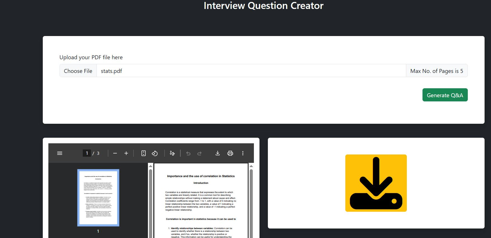

# 🤖 AI Interview Question Generator

> **Generate interview questions and answers from PDF documents using AI**

A production-ready web application that automatically creates comprehensive interview Q&A materials from PDF documents using OpenAI's GPT-3.5 and LangChain. Successfully deployed on AWS EC2.

   

## 🎯 Features

- **PDF Processing**: Upload and extract text from PDF documents
- **AI Question Generation**: Generate relevant interview questions using GPT-3.5
- **Smart Answers**: Create comprehensive answers based on the questions previously generated
- **CSV Export**: Download Q&A pairs for offline use
- **Web Interface**: Clean, responsive user interface

## 🛠️ Tech Stack

- **Backend**: FastAPI (Python)
- **AI/ML**: LangChain, OpenAI GPT-3.5-turbo
- **Vector Database**: FAISS for similarity search
- **PDF Processing**: PyPDF2/pypdf
- **Deployment**: AWS EC2 (Ubuntu)
- **Frontend**: HTML/CSS/JavaScript

## 🚀 Architecture

```
PDF Upload → Text Extraction → Text Chunking → 
AI Question Generation → Vector Storage → Answer Generation → CSV Export
```

## 📸 Demo

### Application Interface
**

### Question Generation Process
*[Add your demo video or processing screenshots here]*

## ⚙️ Installation

### Prerequisites
- Python 3.12
- OpenAI API Key

### Local Setup
```bash
# Clone repository
git clone https://github.com/PrakyathMC/Interview-Question-Creator.git
cd interview-question-generator

# Create virtual environment
python -m venv .venv
source .venv/bin/activate  # Windows: .venv\Scripts\activate

# Install dependencies
pip install langchain langchain-community langchain-openai fastapi uvicorn aiofiles python-dotenv PyPDF2 jinja2 python-multipart faiss-cpu

# Configure environment
echo "OPENAI_API_KEY=your_api_key_here" > .env

# Run application
python app.py
```

Visit `http://localhost:8080` to use the application.

### AWS Deployment
```bash
# Launch Ubuntu EC2 instance
# Install dependencies
sudo apt update && sudo apt install -y python3-venv swig build-essential

# Setup application (same as local)
# Run on port 8080 with security group allowing HTTP traffic
```

## 🔧 Key Technical Challenges Solved

**Environment Management**: Resolved Windows vs Linux environment variable conflicts for seamless local-to-cloud deployment.

**Dependency Resolution**: Fixed complex LangChain version compatibility issues and FAISS compilation on Ubuntu.

**Production Deployment**: Configured AWS EC2 with proper security groups and error handling for stable production environment.

## 💡 How It Works

1. **Upload**: User uploads a PDF document
2. **Processing**: Text is extracted and split into manageable chunks
3. **AI Generation**: GPT-3.5 generates relevant interview questions
4. **Vector Search**: FAISS creates embeddings for semantic search
5. **Answer Generation**: AI generates comprehensive answers using retrieved context
6. **Export**: Results are formatted and available for CSV download

## 🎯 Use Cases

- **HR Teams**: Generate interview questions from job descriptions
- **Educators**: Create assessments from educational materials  
- **Trainers**: Develop quiz content from training documents
- **Recruiters**: Build technical interview questions from documentation

## 📊 Performance

- Processes PDFs up to 50MB
- Generates 5-15 questions per document
- Average processing time: 30-60 seconds
- Supports concurrent users


## 🏆 Skills Demonstrated

- **LLMOps**: End-to-end AI application development
- **Cloud Deployment**: AWS EC2 production deployment  
- **API Development**: RESTful API design with FastAPI
- **Problem Solving**: Complex debugging and dependency management
- **Vector Databases**: FAISS implementation for semantic search

## 📄 License

MIT License 

## 👨‍💻 Developer

**[Prakyath]** - AI/ML Engineer

- 💼 [LinkedIn](https://www.linkedin.com/in/prakyathmc/)
- 📧 [Email](chandranprakyath@gmail.com)


---

*Built with ❤️ using FastAPI, LangChain, and OpenAI*
